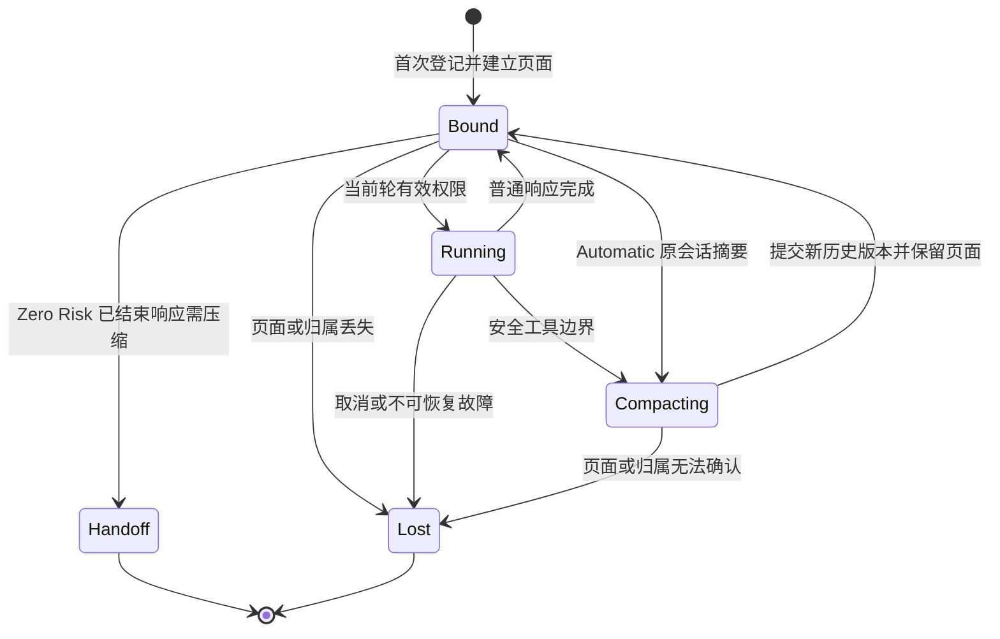

# 会话连续性优先模式：规格与实施计划

版本：0.5。主体修订日期：2026-09-29。2026-09-30 当前工作规则已由 [第三版规格](current-work-validation.md) 按其明确范围替代；本轮用户通过 Build 委托本地实施。当前结果、实际验证和独立审查见 [第三版实施记录](current-work-build.md)。下文 v0.5 最小校验的累计第 10 轮、844 pass 和两个 P2 是第三版之前的历史状态，不代表第三版验证；真实 ChatGPT 页面链路仍未验证。

原连续性实施状态（2026-09-28）：用户已明确需求实现完成，并要求移除额外发布门禁。P0 末次结果见 [P0 实施记录](p0-work.md)；此前的响应归属和导航失败不再代表其最新状态。P1—P4 的代码路径已接入；兼容的 Full Native + Launcher 环境按现有配置和账户条件提供六个连续性别名，不再要求额外内部验证位。真实产品链路、五页资源、真实 24 小时和独立代码审查仍作为验证覆盖记录，不再作为运行时别名门禁。原实施结果见 [实施与验收记录](work.md)，本次 v0.5 的当前状态见 [最小校验附件](minimal-validation.md)；未修改的产品合同继续有效。

阅读入口：本文给出产品行为、生命周期、预算和验收；[最小校验附件](minimal-validation.md) v0.1 完整定义 v0.5 的当前工作识别、增量选择、工具结果幂等、压缩版本定位和实施顺序，属于本规格的规范性内容。[决定记录](decisions.md) 保存取舍、理由和实际确认范围。用户已确认 D1—D5，并委托最小校验的设计、实施和本范围审查修复；不将该授权写成用户逐项批准所有内部技术选择。

本次实质变化：信任既有鉴权边界内的 Codex 客户端，以本地 owner/lease/head、当前工作身份及压缩事务管理连续性；取消完整历史前缀、客户端输出回显和 checkpoint 历史位置的内容证明。旧历史改写不再单独阻断当前合法工作，但不会同步修改原网页，也不保证检测未观察到的外部执行。当前指令/source/结果身份、局部负载冲突和必要 checkpoint 匹配仍保留；无法唯一定位时停止。预算、首次登记、禁止重建、工具权限、Zero Risk、24 小时和五页合同不变。不增加校验档位或公共协议字段。

## 1. 目标与首版边界

让一个任务尽量在同一 ChatGPT 会话中完成。正常续接发送必要增量；外层历史达到预算时，由原会话生成摘要；摘要替换 Codex 的执行历史后，继续原物理会话。找不到原会话或不能证明归属时，明确停止，由用户主动交接。

采用可选模型别名，不改变现有默认路由的恢复策略。产品文案使用“会话连续性优先”；预算文案使用“执行历史预算”。不得宣传为百万 token 的网页模型记忆，或永不压缩模式。

首版建议范围：

| 场景 | 行为 |
| --- | --- |
| Launcher 托管、启用 Native 工具的 Sol/Pro Automatic 路由 | 提供连续性别名；继承原模型、推理档位和账户门槛 |
| Launcher 托管的 Zero Risk / Zero Risk Pro | 提供对应别名；保留人工提交普通轮次的流程和已确认压缩限制 |
| verified-environment / delegated authority | 均维持原权限合同；delegated 仍要求请求携带精确来源证明 |
| 远程桌面部署 | 仅在同样的 Launcher 归属合同成立且通过远程验收时开放；保留远程 idle 规则 |
| Luna / Think、browser-only、没有 Launcher 的浏览器路径 | 首版不开放新别名；现有行为继续有效 |
| 旧别名、原生模型、API-Key 上游 | 行为和预算保持现状 |

连续性别名采用用户指定的独立前缀 `chatgpt-web-continuity/`，后面保留原公开路由的模型名。例如 `chatgpt-web/gpt-5.6-sol` 对应 `chatgpt-web-continuity/gpt-5.6-sol`，`chatgpt-web/zero-risk` 对应 `chatgpt-web-continuity/zero-risk`。不发布此前草稿的模型名后缀方案，也不为未发布的草稿名称新增兼容别名。不复制已隐藏的 legacy 别名，不把连续性路由排在原默认模型之前。别名表示策略，仍映射到原 backend model。首版不提供额外策略编辑器。

`chatgpt-web/` 和 `chatgpt-web-continuity/` 都是项目拥有的 Web 路由命名空间。保留旧前缀的全部既有路由；新增前缀必须进入相同的 Web 分类，再绑定连续性策略。未知或当前不可用的新前缀模型应明确拒绝，不能落入 Native / API-Key 上游转发。目录中的 Web 行过滤、原生模板选择、上游模型名冲突检查、DEV 模型参数解析和 smoke 筛选必须识别两个前缀，不能只更新模型选择器中的文字。

需要明确展示的兼容边界：

- 在某个 native thread 首次选择连续性别名，表示为本模式主动建立一次新会话，可以携带完整历史；不接管旧模式的原页面。这不要求证明 thread 从未使用过其他模式。说明文案必须明确该起点以及单次输入限制。
- 同一 thread 建立连续性绑定后，不再以切换连续性别名、模型、推理档位、账户、connector、交互方式或 saved-chat 设置重建该绑定；需要新会话时主动交接到另一 thread。用户退出本模式选择其他路由，是显式退出连续性保证。桥接器观察到退出时将该绑定标记为终止；旧 owner 尚活动时先拒绝切换，待旧轮次完成或用户取消后，其他路由再按原合同运行。再次选择连续性别名时不得复活终止绑定，需换 thread。对未观察到的外部模式切换或历史改写，不再承诺通过全文比对检测；回来时当前 scope、owner/head、工作或 revision 无法确定仍拒绝。外部历史记录不能取得工具权限，旧历史修改也不会回灌原页面。需要更正时发送新指令，需要重写过去时另开 thread。
- resume、fork 或继承历史的子任务按各自原生 thread identity 处理。有本模式登记的 thread 只能严格续接；尚未登记的 thread 可以首次启用，但必须提供完整规范历史并通过原单次输入检查。不同 thread 不共享物理页面。
- `experimentalFreshConversationPerTurn` 与本模式冲突。别名不可选；直接指定时在任何浏览器提交前拒绝，并说明关闭该设置。不得静默改变全局设置。
- 首版不叠加 Bigger Context。开启该设置时同样隐藏并拒绝连续性别名。多段传输能力继续供原路由使用。这使 100 万历史预算不会自动变成一次多消息上传。
- 保存聊天可以按既有偏好使用，但保存的网址不是自动恢复凭证。首版不通过聊天 URL 重开或搜索旧会话。
- 为阻止重启后误建旧会话，本提案会长期保留少量本地 thread 登记，不存对话内容或工具凭据。登记最多 10,000 条、4 MiB；满额后拒绝新的连续性任务，已有任务可继续。首版不自动清理这些登记，也不增加逐条删除界面。

这些范围限制需随本文一起审核。若首版必须同时兼容被排除的组合，应先补对应归属和传输验收，不能只增加可见模型行。

## 2. 三种预算

| 名称 | 含义 | 新模式处理 |
| --- | --- | --- |
| 执行历史预算 | Codex 保存、重放和估算的当前规范历史 | 1,000,000 tokens；目标自动压缩阈值 900,000 |
| 单次网页输入预算 | 本次实际提交的文字、指令、工具说明和附件 | 使用原账户与模型的输入、字符和附件边界 |
| 上游有效上下文 | ChatGPT 本次实际可使用的内容 | 不可由本地数字推算；不提供无限续接保证 |

连续性别名发布 `context_window = max_context_window = 1_000_000`、`auto_compact_token_limit = 900_000`、`effective_context_window_percent = 90`。这些字段在此别名中承载执行历史预算。不得修改用户的全局 `model_context_window` 或全局压缩配置。

拆开“目录中的历史预算”和“网页提交前的限制解析”。`assertChatGptWebInputWithinLimits()` 等网页检查不得改用放大的目录窗口。尤其是 Plus 没有显式 message token limit 的分支，仍须保留原基础窗口形成的单次输入边界。Zero Risk 保持原有字符、附件和人工提交约束，不增加 DOM 检查。

Usage 对新模式继续估算完整、当前规范执行历史及本轮结果，标记为估算值。压缩后按已替换历史重新计算。不能只上报本次增量来让外层历史无限增长。另行记录本次实际发送的 token / 字符估算，供输入检查及诊断；这两个计数不能互相替代。Luna 的已有计费和滚动检查点机制不参与本次改动。

先选择实际要发送的初始或续接 prompt，再做输入预检。已有健康会话收到短增量时，不得因完整历史超过旧的网页窗口而拒绝，也不得为完整历史预先启动分段上传。第一次新建会话仍检查完整初始输入；超大初始输入或超大增量直接拒绝，不能靠新会话重试。

900,000 是无用户覆盖时的目标阈值。官方配置中未设置压缩阈值会采用模型默认值；当前官方源码还会限制实际阈值。实施前必须用目标 Codex 二进制验证目录、实际阈值、usage 驱动和压缩后的计数，并覆盖高于和低于目标值的全局 window / compact 配置。较高配置仍应受目录最大窗口及实际压缩上限约束；如果目标版本不能保持本模式的有限上限，则该版本不能开放新别名。用户显式设置较低窗口或阈值时尊重该值并说明其影响，不改写配置，也不承诺仍在 900,000 才压缩。见 [官方配置说明](https://developers.openai.com/codex/config-reference/) 和 [当前 ModelInfo 实现](https://github.com/openai/codex/blob/main/codex-rs/protocol/src/openai_models.rs)。

## 3. 会话、历史与权限分别管理

| 对象 | 用途 | 能否随压缩变化 |
| --- | --- | --- |
| native thread | 用户任务边界；不同 thread 不共享物理会话 | 不变 |
| 连续性策略和模型身份 | 区分模式、模型家族、effort、账户、connector 及 provider 设置 | 当前绑定期内不变 |
| 物理 conversation identity | 精确指向 Launcher 的同一 surface / tab lease | 成功压缩不变 |
| history revision | 本地已提交的 checkpoint 版本；摘要只作候选定位 | 成功提交摘要时推进 |
| execution / request identity | 当前指令、工具批次、HTTP 重连和相同逻辑请求的重放 | 按附件区分当前身份与负载，不使用完整历史相等 |
| broker capability | 当前轮次的工具权限 | 每轮重新绑定；旧权限及时撤销 |

在可信的模型路由绑定阶段写入内部 `conversationPolicy`，例如 `recoverable` 或 `continuity-first`。策略必须经过普通 Responses 和所有 compaction 入口到达 Adapter。不能从用户文字、摘要文字或任意请求 metadata 取得该内部字段。

现有恢复模式继续使用原身份规则。新模式的物理 key 包含任务、账户/provider、原模型家族、effort、交互方式、connector、聊天存储偏好和策略标识，但不含 checkpoint 内容。历史 revision 独立保存。

新模式的 execution registry 与 round replay 继续按可信 scope 和本地确认的 history revision 分区。普通执行绑定 native thread/turn、当前指令身份及其负载；结果 round 绑定本地已发批次；压缩事务绑定 source execution/revision。完整 input、旧 assistant 内容和历史长度不再是工作键或准入证明。同一身份更改当前负载不能靠新 digest 变成新执行。source 查找仍精确指向压缩前的分区；物理 key 稳定不能放宽 delegated source identity 或工具结果去重。精确组成、缺失身份处理和本地 generation 语义见 [最小校验附件第 3 节](minimal-validation.md#3-当前工作的最小身份)。

新模式需要一个最小绑定记录，连接物理 key、当前运行 owner、当前 history revision、最后成功使用时间与连续性状态。可复用现有 session / transaction 存储；无需引入通用策略框架。记录必须支持：

1. 相同逻辑工作在当前身份和局部负载匹配时重新附着或重放已有结果，回传旧历史的表示变化不创建第二次网页提交。
2. 同一物理会话最多一个普通执行或压缩事务持有写入权。冲突请求明确失败或按现有顺序排队；不得并行向同一页面发送。
3. 提交 checkpoint 后，将旧 revision 到新 revision 的关系绑定到精确 source identity 和一次性 control handoff。只允许已登记的过渡；任意摘要不能打开续接权限。
4. 新 revision 的续接只发送被当前原生指令或已提交过渡明确选中的新输入和当前轮必需的执行环境，不依赖旧回答逐字相等或 checkpoint 前缀长度/digest。网页中已完成的工具调用和摘要不再被当作工作指令重发。Codex 重建 message ID 时，继续使用既有合法映射与 delegated 限制。
5. 过期 revision 不能作为新工作继续执行。已知旧普通工作或压缩事务只按本地记录重放；结果回收后明确失败。相同摘要可属于多个 revision，不能直接取最新版本；必要区分信息不足时停止。具体顺序见 [附件第 5 节](minimal-validation.md#5-压缩保留提交关系不证明历史位置)。

客户端历史仍用于规范上下文、完整 usage 和既有 Responses 展开，但不认证网页中的全部过去。工具结果只按本地已交付的当前批次接收，当前结果冲突不得覆盖第一次结果；旧 tool-call 回显不驱动执行。Native operation 启动描述指纹、queued/delivered 分界和 capability 规则不变。普通新指令与工具 round 的增量和重放语义见附件第 3—4 节。

### 首次建立与会话丢失

普通续接也必须执行禁止重建策略，不能只在 `/compact` 分支处理。

首次启用信号是：尚无本模式登记的 native thread 发出普通 Responses 工作请求，并显式选择连续性别名；可信路由将该选择转换为内部策略。该信号不证明 thread 空白，也无需证明。必须有原生 thread / turn、当前普通指令 identity 和当前有效权限环境。

首次输入可以包含此前的 assistant、已完成工具记录和 checkpoint。它们作为完整初始上下文，通过原单次输入预检后才建立页面，不自动拆成多条消息。`previous_response_id` 必须先成功展开；缺失仍返回 409。旧 checkpoint 只提供历史内容，不能充当本模式的 handoff / 归属证明。首次规范输入建立 revision 0，之后只有本模式已验证的压缩提交能推进该 revision。

单独的压缩请求、仅用于交付未归属工具结果的请求，或缺少当前普通指令的 checkpoint 续接请求不能激活本模式。首次选择时若本桥接器仍有该 thread 的活动旧 owner 或未交付工具结果，先明确拒绝并让旧轮次完成或由用户显式取消，不能把旧工具交给新 owner。旧模式首轮已经中断且没有存活 owner 时，即使输入看起来空白，也按用户的首次启用选择处理，不声称在续接旧页面。

完成输入、权限和兼容预检后，在第一次创建网页前，持久记录该 thread 已进入连续性模式及其 owner 标识。同 thread 的首次并发请求只能取得一个创建权。登记失败时不得创建网页；同一运行 owner 的未提交重试复用原创建事务。

此记录只用于阻止误重建，不保存网页权限或提供恢复能力。重连先找存活执行；已有绑定则必须要求精确保留会话。旧 owner 的登记意味着需要主动交接。登记数据损坏时拒绝，不能当作空登记开始工作。

已有连续性登记、旧运行 owner 的登记或损坏 / 不可读取的登记存储，都不能作为首次请求。绑定后的输入即使只剩一条 user 消息，也仍须核对原 owner 和页面；不能靠重发首次请求绕过禁止重建。首次启用与绑定后的恢复以登记和有效 owner 区分，不能按历史消息数量猜测。

首版没有可靠的原生 thread 删除通知，所以登记采用保守的有界保留：

- 不按时间、session TTL、响应缓存 TTL 或 LRU 删除登记；不通过扫描本地 rollout 猜测远程 thread 是否已经删除。
- 仅保存 thread 的不可逆索引、策略 / 模型范围摘要、创建 owner 及最小状态，不保存对话、工具结果、聊天 URL、token 或其他凭据。活动 head、完整 checkpoint 和 replay journal 仍在原有有界存储中。
- 固定上限为 10,000 条，序列化文件不超过 4 MiB。达到任一上限时，在网页创建前拒绝新的连续性 thread；不淘汰旧登记。已登记且仍健康的任务可继续或压缩。写入错误时同样拒绝首次创建。
- 首版不提供逐条自动或人工删除登记的产品入口。登记只随用户明确删除 / 重置整份桥接配置资料而删除；该动作结束此配置下的所有连续性任务，后续必须使用新的空白 native thread。不得在正常启动、升级或存储损坏时自动重置。
- 安装 / 升级模式时建立受控的登记存储和已初始化标识；已有标识而文件丢失、损坏或不可读时，明确报错，不能把它当作首次安装。内部文件格式和初始化事务可沿用项目现有配置写入方法。

这个登记是防止重复创建的记录，不是会话恢复机制。未来有可信 thread 删除事件时，可以另行设计清理，首版不依赖该事件。

进程重启、标签页关闭、空闲过期、登录或 connector 状态失效后，如果精确归属不能继续证明，则状态变为 `lost`。不得从规范历史新建网页，也不得重新执行已接受工具。最小持久登记与现有存活 registry 的配合，是阻止“重启后第一次请求再次创建页面”的验收重点。

## 4. 必要压缩事务

压缩仅由 Codex 的显式 compact 请求或生效的外层预算触发。项目不增加每轮后台摘要、预测性提前摘要或网页保活消息。必要压缩允许在安全工具边界结束当前响应；成功条件是下一次工作仍使用同一物理会话。

### 活动响应

沿用 Broker 的 queued / delivered 分界。尚未交给 Native 的调用可转成压缩控制结果；已经交给 Native 的调用必须按现有归属接收真实结果。不能把已交付调用当作未执行，也不能让第二个 owner 接管并重执行。

通过当前会话的合法控制路径请求摘要。摘要只能经绑定 source 的结构化 handoff 被接受；普通 assistant 文字不能充当 handoff。摘要阶段不能取得额外工具执行权限。

Zero Risk 的“活动”判断不是摘要成功保证。分支以是否已送达压缩控制为准：响应在任何调用收到控制指令之前结束，且活动交接返回“未交接”时，重新按已完成响应处理。保留普通 final 和已取得工具结果，返回 `continuity_manual_handoff_required`，不替换规范历史、不发送第二条网页消息、不新建页面，也不复制 fresh prompt。控制已经送达，但 handoff 无效、超时或被取消时，按相应压缩失败 / 取消处理；仍保留已取得结果、不替换历史，并禁止 fresh fallback。这两类终态不能混用。

### 已完成响应

- Automatic：在精确保留页面上提交一次仅有压缩控制权限的摘要请求。强制 `requireRetainedConversation`。找不到页面立即失败。
- Zero Risk：返回明确的手动交接状态，不自动提交第二条消息，不创建 fresh manual chat，不新增用户提交压缩请求流程。原已完成回答和工具结果保留。

### 成功提交与下一轮

成功顺序为：验证 handoff → 确认摘要响应已终止且旧 helper 不再写页面 → 撤销旧普通与压缩 capability → 保存可重放的压缩结果并推进 history revision → 将同一 surface 交回 ready 状态 → 返回 Codex 要求的 replacement history / message 格式。

需要将当前“结束旧 execution”和“关闭物理 conversation”拆开。连续性成功路径不得调用同时关闭该页面的退休方法。两步之间由同一事务保护；在结果可安全重放、页面可确认继续使用之前，不报告压缩成功。已有普通 final answer 继续按现有完成结果规则重放，不能被压缩摘要覆盖。

下一轮获得新的 capability，更新工具环境，再向同一页面提交增量。保留页面不意味着保留旧 `turn_token`、Zero Risk `request_id` 或已撤销 control token 的有效性。

### 重试、断开、取消和失败

| 事件 | 必须保持的结果 |
| --- | --- |
| 同一压缩请求并发或响应丢失后重试 | 复用同一事务或重放唯一提交结果；不再次让模型生成摘要 |
| handoff 接受前的取消 / 失败 | 不替换外层历史；依既有取消合同释放 owner；不能建立新会话补救 |
| handoff 已接受，但终止 / 页面保留状态不明 | 不猜测成功；保留事务证据并明确失败；不得再提交第二次摘要或继续普通任务 |
| 压缩已经提交，但返回途中断开 | 同一运行 owner、原物理归属和相应 revision 仍可证明时，只重放已提交结果；不回滚到旧 revision 后继续执行；迟到清理不得关闭下一轮页面 |
| 已提交结果尚未送达，进程随后重启或页面丢失 | 不把旧摘要缓存当作物理续接证明；返回会话丢失 / 归属不可证明错误，不返回一次新的压缩成功，不重发摘要请求，也不删除已经保存的结果记录 |
| 工具结果晚到 | 按原 capability / call identity 路由或给出既有明确退休结果，不分配新调用 |
| 显式任务取消 | 撤销对应执行和控制权限，保留已经获得的结果记录；不把取消当成自动恢复入口 |
| 上游拒绝摘要输入或已无法生成摘要 | 明确停止；不承诺同会话摘要必然能释放上游上下文 |

网络重连保持现有重放合同。新增策略不能把普通 HTTP 查询断开自动解释为用户取消，也不能改变现有显式取消的含义。若事务证据或 replay cache 已失效，返回明确错误，不能通过重新生成摘要“修复”。

## 5. 所有新会话入口统一受策略约束

应逐一覆盖普通任务、显式 compact、自动 compact、活动响应交接、已完成响应压缩、source 缺失、source 冲突、handoff 前会话消失和手动页面创建。新模式只有符合第 3 节首次启用合同的普通任务能够新建页面；任何压缩或已登记 thread 的恢复请求都不能新建。

Automatic 已有 `requireRetainedConversation` 合同可作为浏览器最后一道检查。Zero Risk 的 manual start 合同也必须增加对应要求，并在新建标签页或复制 fresh prompt 到剪贴板前拒绝。Adapter 判断健康而 Launcher 已失去页面的竞态同样必须失败。

Delegated source 缺失或冲突时维持原有拒绝和权限退休要求，但禁止进入 fresh summary 分支。不得用 rollout alias 或摘要内容代替请求携带的来源证明。恢复模式的已有 fresh/fallback 行为保留。

新增字段涉及 Adapter、helper 与 Launcher 时，需要明确能力版本。旧组件不能默默忽略严格续接字段。启用新别名前完成兼容检查；不支持时在任何新页面或网页输入发生前拒绝。普通路由的旧组件兼容不因此扩大改动。

## 6. 空闲保留与资源

连续性模式的逻辑 session 与 ready 标签页使用同一 24 小时空闲时长，即 `86_400_000 ms`。普通模式继续原有 30 分钟。只有成功工作、合法续接或压缩完成可更新最后使用时间；后台查询、状态刷新或网页无意义消息不能延长空闲期限。活动执行仍依原 owner / heartbeat / remote idle 合同管理。

24 小时内，健康的连续性 ready 标签页不参与为了给新任务腾位置的自动淘汰。保留现有 5 个标签页上限。没有其他可回收页面时，第 6 个任务明确提示关闭一个已有页面；不得默默牺牲连续性会话。逻辑 session 容量淘汰也不能绕开同一规则：保护当前 conversation head 及必要 checkpoint 映射，历史 execution 的 replay 记录仍可按原容量限制回收。回收旧记录不能释放当前页面或使过期请求重新执行。

24 小时不等于所有 replay cache 都保留 24 小时。现有 `previous_response_id` 缓存有独立的 1 小时及容量限制；缺失时继续返回 409，不用 partial history 调用网页。客户端重发完整规范历史后，仅在原绑定和当前 revision 仍可证明时续接同一页面。checkpoint / execution 重放证据已过期而又无法完成匹配时明确失败；不得为此新建页面。实施验收必须包含“页面仍在，但 Responses cache 已过期”的组合。

用户关闭页面、显式取消、运行端失联、权限退休、空闲到期和上游故障仍按相应真实条件处理。不得延长工具 capability 的有效期来实现页面保留，也不得关闭 helper 心跳、启动期限、远程 idle 或明确任务期限。

增加新模式后需测量：满额 5 页的浏览器内存、长历史请求体和解析内存、usage 计算耗时、checkpoint 和重放缓存占用。1,000,000 是 tokens 预算，不代替现有 HTTP 字节、缓存容量或进程内存边界。当前 HTTP 编码 / 解码限制分别为 64 / 128 MiB，Responses 内存缓存高水位为 64 MiB；磁盘快照单条超过 2 MiB 会跳过，总量上限 24 MiB。若现有边界先到达，明确拒绝并保留连续性失败原因，不能静默截断历史或自动迁移。

## 7. 错误与用户交接

错误必须有可识别分类；下列代码名为实施建议，语义是验收合同：

| 原因 | 用户应获得的信息 |
| --- | --- |
| `continuity_session_lost` | 原会话或归属不可恢复；没有自动创建新会话；已有文件和已取得工具结果不回滚 |
| `continuity_source_unproven` | 无法确认摘要来自哪个原会话；没有替换历史或新建摘要会话 |
| `continuity_manual_handoff_required` | Zero Risk 响应已结束，不能自动压缩；需要用户保存可用状态并另开任务 |
| `continuity_configuration_conflict` | 模式与每轮新会话、Bigger Context 或当前组件能力冲突；说明对应设置 |
| 现有 `context_length_exceeded` | 本次实际输入过大；减少本次输入；不能建议靠本模式的新会话兜底 |
| 现有资源容量错误 | 需要用户关闭一个会话或释放资源；不能自动淘汰受保护页面 |

沿用现有 Responses 错误和 Launcher 状态展示，不增加完整恢复向导。通过错误映射和 retryability 防止确定性失败被服务端无限重试。相同错误重试不得创建新页面。

交接由用户主动控制。首版文档提供简短交接清单：目标、已完成改动、已取得工具结果、当前文件 / Git 状态、未决问题、下一步。用户可在会话健康时要求模型写交接文件；桥接器不擅自往用户项目写文件，也不承诺会话丢失后还能补全未知信息。

## 8. 实施顺序

下表保留原 v0.4 的 P0—P5 实施安排，其实际完成状态以本文开头和 work.md 为准；表中历史发布顺序不重新建立额外别名门禁。本次 v0.5 按 [附件第 7 节 S1—S4](minimal-validation.md#7-修改落点和实施顺序) 推进，不重跑完整首版设计流程。共享文件较多，不应按表格行盲目并行修改。

| 工作项 | 依赖 | 修改范围与交付结果 | 验证 / 完成条件 |
| --- | --- | --- | --- |
| P0：兼容与平台证据 | 本规格 | 为目标 Codex 版本准备隔离目录试验；用受控测试会话验证摘要后同页续接；记录版本、有效阈值和物理 surface | 目录 100 万 / 90 万确实生效；结构化摘要后能在原页绑定新 capability；若失败，重开相应决定，不能发布“连续性”别名 |
| P1：可信策略与预算拆分 | P0 的目录语义证据 | `chatgpt-web-models.ts`、`model-catalog.ts`、`types.ts`、路由绑定入口、`usage.ts`、`browser-worker.ts`，以及新前缀分类与配置入口 | 新前缀进入 Web 路由而不被上游转发；内部策略来自可信别名；目录预算与网页限制分别测试；旧模式不变；暂不对用户开放别名 |
| P2：身份与严格续接 | P1 | `conversation-key.ts`、`turn-execution.ts`、配置初始化及最小连续性登记、`launcher-browser-host.ts`、helper 协议、`browser-host.cjs`、manual start | 压缩 revision 与物理 key 分离；首建 / 重连 / 丢失 / 重启可区分；登记满额、缺失和损坏有确定性拒绝；Automatic 与 manual 竞态均不能新建 |
| P3：同会话压缩提交 | P2 + P0 的同页平台证据 | Adapter `index.ts`、compaction transaction / continuation / handoff、Broker、浏览器结束路径、Responses compaction | 成功只释放旧执行与权限；原页保留；重试只返回同一摘要；所有 fallback 受策略约束；Zero Risk 已结束响应明确交接 |
| P4：资源与用户反馈 | P2、P3 | session 回收、Launcher ready TTL / 容量淘汰、错误映射、必要设置说明与用户文档 | 24 小时保留一致；第 6 页不淘汰受保护页；失联 / 取消仍生效；错误文案能指导交接 |
| P5：集成验收与开放别名 | P1—P4 | 测试、Codex smoke、真实 ChatGPT / Launcher 验收、架构 / 安全 / 发布文档 | 下节矩阵通过；记录限制和版本；最后开放别名，原默认保持不变 |

P0 不是超长会话寿命研究。按用户确认的验证方案，以短窗口验证压缩行为，再用真实目标 Codex 和本地受控 usage 检查 100 万 / 90 万配置，无需构造百万 token 历史。真实页面完成“工具 → 原页摘要 → 原页新权限 → 下一次工具”的闭环：Automatic 活动、Automatic 已完成、Zero Risk 活动三条路径各在独立短会话中连续成功两次；另核验 Zero Risk 已结束及控制送达前结束的停止边界。实验入口只服务 P0，完整集成留给 P1—P5。不能通过 stub 测试声称上游支持；短窗口及数值语义通过也不证明百万历史的性能、内存或上游承载能力。完整安排和证据见 [P0 实施记录](p0-work.md)。

P1 的前缀核对还包括 `src/server.ts`、`src/api-access.ts`、`src/api-key-codex-config.ts`、`src/dev-chat/cli.ts`、`src/dev-chat/session.ts`、`launcher/electron/codex-model-metadata.cjs` 与 `scripts/smoke-codex-catalog.ts`。这些入口当前含有只识别旧命名空间的判断；DEV session 还用 `DEV_CHAT_MODELS` 固定清单校验模型和持久状态。实施时按真实用途修改，原 namespace 和 Native / 上游的其他模型合同保持不变。

实施者可以选择内部字段名、存储文件布局、错误码名和局部模块拆分。不能自行改变用户已确认预算、保留时间、Zero Risk 边界、禁止重建或首版压缩后保留原页的目标。遵守 [Native 长等待规格](../native-tool-long-wait/spec.md) 及其 [实施记录](../native-tool-long-wait/work.md)；当前代码已有 per-capability operation 和 wait 状态。本模式保持 queued / delivered、公共结果重放、完成屏障和失联租约合同。文档中的历史“未实施”段落不等于当前实现状态，真实平台验证也不能仅凭代码存在而推定。

## 9. 验收矩阵

| 场景 | 核验结果 |
| --- | --- |
| 旧模式与新模式并存 | 旧目录、旧压缩换页和原 fresh fallback 测试仍成立；新增别名不改变默认、账户门槛、effort 或 Native 子代理目录能力 |
| 连续性模型命名空间 | `/models` 和 Codex 目录发布 `chatgpt-web-continuity/<原模型名>`；普通 Responses 与全部 compaction 入口识别新前缀；未知 / 不可用模型在浏览器或上游调用前拒绝；两个 Web 前缀均不作为 Native 模板或 API-Key 上游模型；DEV 对受支持的新别名完成完整 slug 的选择、状态保存和读取，保持其现有模式门槛；catalog smoke 正确覆盖两个前缀 |
| 首次选择及旧模式首轮中断 | 未登记 thread 的普通指令可以携带完整历史首次建立；旧模式中断但尚无任何返回内容时同样适用；不声称复用旧页；活动旧 owner / 未交付工具结果存在时拒绝切换；verified 和 delegated 均覆盖 |
| 首次输入无法启动 | 过大完整历史、缺失 previous response、仅有压缩 / 工具结果续接、权限不完整分别在网页创建前拒绝；不能另开摘要会话缩短首次输入 |
| 外层历史越过旧阈值、增量很短 | 同一 surface 继续工作；没有旧阈值触发的强制 handoff；网页预检仅针对实际输入 |
| 接近新阈值 | 目标 Codex 在约 900,000 的生效预算触发压缩；不通过虚报增量 usage 隐藏历史增长 |
| 活动 Automatic 压缩 | 已交付工具结果回到原调用；尚未交付调用按控制合同结束；摘要后同一页面继续下一次工具 |
| 已完成 Automatic 压缩 | 同一页面只提交一次控制摘要；已完成 ordinary final 可重放；下一轮为新 capability |
| Zero Risk 活动压缩 | 原 MCP 控制路径得到有效摘要时保留原 manual 页面；下一轮仍需用户按原流程提交；若响应在控制送达前结束，则手动交接，零新增消息 / fresh 页 / 剪贴板 fresh prompt，规范历史不替换 |
| Zero Risk 已完成响应后压缩 | 明确手动交接；零自动网页消息，零 fresh 页面，零 fresh prompt 剪贴板写入 |
| 缺失 / 冲突 source、交接前丢页 | 无摘要迁移，无工作迁移；验证 Automatic 和 delegated；原权限按既有要求退休 |
| 普通续接丢页与重启 | 逻辑记录仍在 / 已过期、helper / bridge / Launcher 重启、前一响应回执丢失均不误判首建 |
| 重选别名与历史形状改变 | 已登记 thread 重发初始请求、删减为单条 user、退出再进入模式或换连续性别名，均不能触发新的首次建立；新增的 fork thread 独立判断，不继承物理页面 |
| 已完成历史表示或正文变化 | 当前身份和工作边界仍明确时可继续；不依赖前缀/输出 digest；只发送当前新输入，不同步旧改写，不据历史记录创建或交付工具 |
| 当前身份和结果负载冲突 | 同一身份换当前工作或当前结果时拒绝，不靠 changed digest 再执行；较早批次重放命中自己的 journal，未知末端结果不冒充普通重连 |
| 首建登记寿命与容量 | session / Responses cache 过期和进程重启不删除登记；10,000 条或 4 MiB 上限前拒绝新建且旧任务可继续；文件缺失、损坏或写失败时不创建页面 |
| compaction 重试 / 并发 / 断开 | 同 source 只有一个提交结果；native call 次数不增加；checkpoint 只推进一次 |
| 已提交摘要回执丢失后重启 / 丢页 | 缓存不能授权新的成功或续接；明确失败，无第二次摘要，无新页；已保存结果仍可用于用户核对 |
| revision 错配、无本地提交的摘要、旧 token | 拒绝续接和工具执行；不能跨 thread、模型、账户或历史版本取得权限；合法摘要不再证明其前缀历史合法 |
| 重复摘要与旧工作 | 不同 source 的相同摘要可各自提交与重放；已有旧工作或 tombstone 不重映射到最新 revision；无法区分的同身份输入明确停止 |
| 超大初始输入 / 超大增量 / 附件 | 原字符、token、附件和请求体限制仍生效；网页发送前明确失败，不截断，不新建补救 |
| 取消与迟到结果 | 在工具执行、摘要接受前后、helper 退出、响应返回阶段分别取消；没有重复副作用、旧 token 复活或迟到清理误伤下一轮 |
| 空闲与满额 | 30 分钟后新模式仍在；24 小时到期才按空闲规则结束；普通模式仍为 30 分钟；第 6 个任务不淘汰连续性页面 |
| 活跃 owner 与失联 | 长任务不因 ready TTL 被终止；helper 失联、远程 idle 和显式取消按原合同终止 |
| 混合版本和冲突设置 | 旧 helper / Launcher、fresh-per-turn、Bigger Context、模式中途切换在提交前拒绝 |
| 资源与日志 | 记录历史 tokens、实际输入、压缩原因、surface 复用、session lost 原因及资源测量；不记录 capability 原文或增加无关遥测 |

本矩阵与 [附件第 8 节](minimal-validation.md#8-验收矩阵) 共同构成验收，附件补充新工作键、元数据兼容、结果冲突和三个压缩入口的具体组合。分层验证：纯逻辑用单元测试；Adapter / Broker / Launcher 竞态用现有 harness；目录和阈值用真实目标 Codex + stub provider；同一 ChatGPT 会话在摘要后的真实续接用隔离测试账号 / 页面。最后一层必须分别覆盖 Automatic 与可支持的 Zero Risk 活动路径。缺失的平台证据必须明确记录为未覆盖，不能由单元测试替代；别名不再使用额外运行时发布门禁。

优先扩展现有 `retained-compaction`、`compaction-v1`、`compaction-browser-recovery`、`local-compaction`、`server-compaction`、`chatgpt-web-models`、`model-catalog`、`browser-worker-contract`、`launcher-browser-host` 和 Launcher `browser-host` 测试。按失败点增补测试，不创建只镜像常量的测试集合。

## 10. 当前证据与剩余风险

v0.5 设计核查基线为 Git `46fa491bbab92b27e5292d1670d661b94c16b416`。下表保留该基线的核查事实，不代表最新 workspace。当前实现已按附件收缩历史检查并保留局部 source、批次和 Native operation 身份；第 10 轮验证合计 17 个文件 844 pass / 1 skip / 0 fail，typecheck 和 diff 检查通过。新的两轴独立全面复审已完成，新增两项 P2 尚未修复，具体状态见 [附件](minimal-validation.md)。没有取得本次真实 Codex/ChatGPT 兼容证据，自动化通过不能代替实际链路验证或关闭独立复现的缺陷。

以下保留初版设计阶段的证据与风险记录；其中“当前”代码描述和测试数字属于当时基线，不是 v0.5 的当前支持程度。后续原实现证据以 work.md 和 p0-work.md 的最新记录为准，不能用旧数字证明本次设计已实现。

核查基线：Git `e7f0f603e7715bfebf561c21f3b41c0525c28014`，项目版本 `6.1.1-1`。本机 Codex 为 `0.157.0`；目录源锁为 `408a77dc1a1cf95413df26b5185623cf245161d7`。二者不能视为相同实现。

本轮运行：`bun test tests/retained-compaction.test.ts tests/chatgpt-web-models.test.ts tests/model-catalog.test.ts`，结果为 **73 pass，0 fail，395 次断言**。这是现有行为的基线，未验证本文目标行为。

v0.3 独立全文复审未发现阻塞问题。仍有一项非阻塞验证缺口：第 9 节尚未单列 `model_auto_compact_token_limit_scope` 的 `total` / `body_after_prefix` 组合。官方配置支持按完整上下文或按已携带前缀之后的增长量计数；默认配置的阈值结果不能代替另一种范围的结果。P0 的后续执行应覆盖目标二进制支持的两种范围，记录实际触发点和用户可见限制，保持用户全局配置不被改写。该项当前没有运行证据，不能视为验收已通过。见 [官方配置说明](https://developers.openai.com/codex/config-reference/)。

当前直接核对的模块：

| 事实 | 来源 |
| --- | --- |
| 模型目录窗口和单次传输限制已有不同解析入口，但输入预检还使用基础 context window | [chatgpt-web-models.ts](../../../src/chatgpt-web-models.ts)，`resolveChatGptWebContextLimits` / `resolveChatGptWebTransportLimits`；[browser-worker.ts](../../../src/adapters/chatgpt-web/browser-worker.ts)，`assertChatGptWebInputWithinLimits` |
| Usage 为 tokenizer 与固定余量估算；Luna 有特殊 checkpoint 路径 | [usage.ts](../../../src/adapters/chatgpt-web/usage.ts)，`estimateChatGptWebUsage`；[模型目录](../../../src/model-catalog.ts)，`context_window` 等字段 |
| Automatic 的严格 retained lease 已存在；manual start 暂无等价 required 字段 | [launcher-browser-host.ts](../../../src/launcher-browser-host.ts)，`LauncherTurnActivity` / `LauncherManualTurnStart`；[browser-host.cjs](../../../launcher/electron/browser-host.cjs)，`startTurn` / `startManualTurn` |
| ready 标签页 30 分钟回收，容量达到 5 页时可以淘汰最旧 ready 页 | [browser-host.cjs](../../../launcher/electron/browser-host.cjs)，`RETAINED_TURN_TAB_TTL_MS`、`MAX_BROWSER_TABS`、`evictOldestRetainedTurnTab`、`reapExpiredTurnTabs` |
| 现有公开架构把 compaction epoch 与页面生命周期绑定 | [架构](../../architecture.md) 的 Browser lifecycle；[安全合同](../../security-model.md) 的 Cross-turn data leakage |
| execution key、物理 key、普通增量是不同层次；session 注册表为内存 Map，默认 30 分钟 / 256 项 | [turn-execution.ts](../../../src/adapters/chatgpt-web/turn-execution.ts)，`chatGptTurnExecutionKey` / `ChatGptTurnSessions`；[conversation-key.ts](../../../src/adapters/chatgpt-web/conversation-key.ts)，`chatGptConversationKey` / `retainedConversationResumeRequest` |
| 成功摘要当前会退休原 conversation；source 缺失及若干 Zero Risk 情况会 fresh fallback | [index.ts](../../../src/adapters/chatgpt-web/index.ts) 的 structured compaction 分支；`retireConversationAndWait` / `retireConversationPreservingFinalResponse` |
| control 事务和 completed compaction 重放是两层内存状态；前者一次性消费，后者合并精确请求 | [compaction-transaction.ts](../../../src/adapters/chatgpt-web/compaction-transaction.ts)，`begin` / `submit`；[compaction-handoff.ts](../../../src/adapters/chatgpt-web/compaction-handoff.ts)，`runStructuredCompactionOnce` |
| continuation marker 只含 prompt 文本；实际归属依赖进程内 checkpoint 与 source hash 记录 | [compaction-continuation.ts](../../../src/adapters/chatgpt-web/compaction-continuation.ts)，`acceptedCheckpoint`；[compaction-handoff.ts](../../../src/adapters/chatgpt-web/compaction-handoff.ts)，`canonicalizeCompactionHandoff` |
| 部分 Response 可从磁盘恢复，不代表 browser / Broker owner 可恢复；前序状态缺失返回 409 | [responses/state.ts](../../../src/responses/state.ts)，`ensureLoaded` / `expandPreviousResponseInput`；[http-body.ts](../../../src/http-body.ts)，`readJsonRequestBody` |
| Broker handoff 已区分 queued 与 delivered；operation 按 capability 管理，撤销时退休 | [turn-broker.ts](../../../src/adapters/chatgpt-web/turn-broker.ts)，`nextToolBatch` / `requestCompaction` / `revoke`；[native-tool-operations.ts](../../../src/adapters/chatgpt-web/native-tool-operations.ts) |
| 当前 Web 模型分类只识别旧前缀，部分配置和工具脚本还直接比较字符串前缀 | [chatgpt-web-models.ts](../../../src/chatgpt-web-models.ts)，`isChatGptWebModelSlug`；[api-access.ts](../../../src/api-access.ts)、[api-key-codex-config.ts](../../../src/api-key-codex-config.ts)、[DEV CLI](../../../src/dev-chat/cli.ts)、[Launcher 元数据](../../../launcher/electron/codex-model-metadata.cjs)、[catalog smoke](../../../scripts/smoke-codex-catalog.ts) |

[Delegated authority 规格](../delegated-tool-authority/spec.md) 中早期 alias-miss 描述与后面的 exact-source fallback 描述有范围歧义。当前实现要求 request-carried source 精确匹配。本模式保留精确匹配并拒绝 fresh fallback，不借本任务修订旧恢复模式的争议行为；相关验收要分别覆盖缺 ID、re-id miss 和真实 identity 冲突。

仍需取得：目标 Codex 有效阈值、摘要后真实同页续接、长时间空闲后真实可用性、近预算历史的资源数据。上述单测不能给出这些结论。浏览器仍在、用户仍登录、原会话可续接和模型仍记得早期细节是不同状态。

目前没有证据证明 ChatGPT 同一会话可以无限工作。若上游不再接受输入，同页摘要也可能失败。产品保证仅是桥接器遵守本模式的保留与失败策略，不是上游寿命保证。

## 11. 交付与后续入口

本轮按用户授权交付 v0.5 最小校验的 workspace 实现及有界审查修复。范围为本文、最小校验附件 v0.1 和 D6，尤其包括旧历史不再认证/不回灌、当前身份与结果仍检查、重复摘要歧义时停止、不新增协议字段及全部未改合同。用户已确认的 D1—D5 不必重复确认。当前独立复审与真实客户端验证状态以附件为准，原审查结论不能代替；不增加运行时别名门禁。

已同步 `docs/architecture.md`、`docs/security-model.md`、`docs/release-validation.md` 和用户说明，明确局部工作识别与历史数据的区别、兼容边界和实测覆盖。未执行的真实客户端、页面、资源和远程验证不标为通过。
